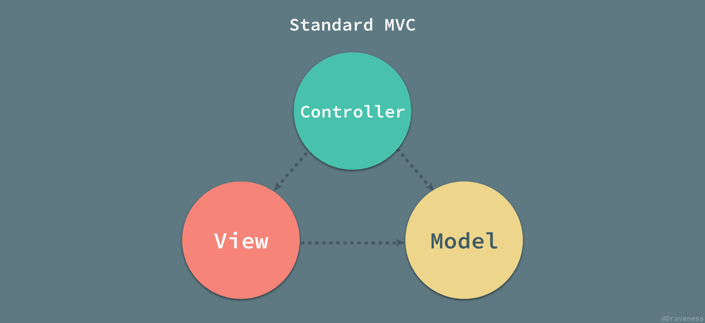
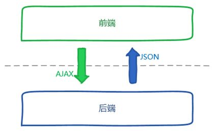
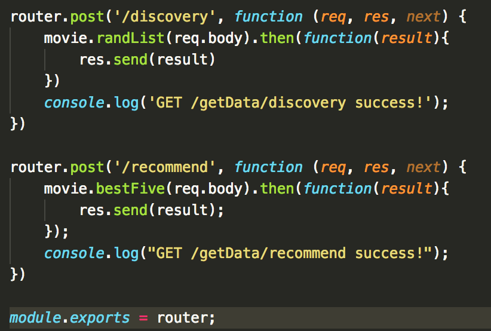

---

layout: post

titile: 我对构建小程序应用的理解

date: 2019-07-01 16:42:00.000000000 +09:00

---
# 我对构建小程序应用的理解
小程序可以看作是微信内建的一个web应用，我认为它与一般的网页没什么本质区别。在小程序里语言用的是JavaScript，这也是构建网页的语言。开发模式是以事件驱动，解决异步调用是这里面的一个特点。
小程序的官方文档只能说基本完善，有很多技术细节可能还是需要结合问题自己在网上多找找解决方案。小程序开发体验并不是很好，有很多的坑需要有开发过程才能感受到。虽然在微信官方社区里经常看到开发者吐槽小程序，但这并不妨碍小程序依然很火爆，毕竟它依托的是微信庞大的社交资源。
针对这次开发的电影小程序以及电商小程序，还需要的一个功能就是后端服务。事实上在互联网产业中大多数业务都是基于客户端服务端的模型。对于web应用来说它们基于HTTP协议进行沟通。这也是我们搭建两个小程序所需要的，后端首先需要一个HTTP服务器，用它来对小程序发出的请求作出反应。这个反应其中就包括了我们对数据库，业务逻辑等的处理。

## 小程序
构建web页面需要HTML、CSS、JS(JavaScript)三类文件，在小程序内则对应的是WXML、WXSS、JS(还有一个WXS，它是一个运行在视图层的东西)。这三者是一一对应的，它们的功能也是相同的，事实上学会了一种，另外一种很快就能上手。由于说的是小程序，下面比照小程序中的三类文件一一说明。
WXML是微信小程序内使用的一种标记语言，它语义化的定义了一个页面应该有哪些元素，比如页面中的一个按钮，一个文本，一张图片等等。在做开发时一般都是要先构思一个页面需要哪些元素，它们以什么样的结构关系组织在一起。
WXSS是微信小程序中使用的堆叠样式表语言，它的作用是给页面制定样式，也就是这个页面以及页面中的元素长成什么样。比如一个按钮的背景颜色是红色还是黄色，一个文本的字体大小是多少，页面中的各个元素以什么样的方式排列，各自的具体位置在哪等等。这个东西能够让你感受到自己是拿着雕刻刀在雕琢页面。
JS是微信小程序中使用的具有“编程”能力的语言。为什么要加个引号，因为上面两种语言其实也是在编程，只是大家职责不同罢了，没了它们JS也没法好好干活。JavaScript最先出来的时候是为了解决网页的互动，后来不断发展壮大具备了更强的能力，现在各个领域都能见到JS的身影，连TensorFlow也有JS语言版本的。在小程序中生命周期、网络请求、业务逻辑、页面视图更新都是由JS来管理完成的。比如我需要向服务器请求某个数据、比如我需要在小程序隐藏到后台时做某件事情、比如我需要在页面中提示用户某些信息。可以理解为JS是干活的，让某某元素干一个什么，或者页面元素触发了什么，我需要去做些什么。
WXS类似JS，只是由于微信小程序的架构而衍生出来的一个文件或者说是一个语言。小程序中JS运行在app-service线程上，页面则运行在另外一个线程。当JS中有数据更新需要表现到视图层时，实际上是通过线程通信完成的，在数据量小时是没什么问题的，但是一旦需要频繁的更新视图层则会造成性能问题。我遇到的相关问题是在使用一个循环动画时遇到了卡顿，实现思路是使用JS调用微信小程序提供的动画api，隔一段时间通过setData的方式更新动画数据。这样的场景实际上使用WXS更合适，它与页面运行在同一个线程之中，性能更好。
我不打算把一些官方文档上有的东西写下来，我只谈我自己的认识与我认为应该怎么理解或者学习。
最好的学习方式是去做一个能用的东西。如果你有构建web页面的基础的话，小程序上手其实还是很快的，如果没有通过学习官方的文档也很容易上手。在了解了基本的内容后就可以开始着手考虑做个什么东西出来了。比如电影小程序，主要目的是展示电影并且收集用户数据。那么一个电影的信息有哪些？海报，名字，演员，下载链接。然后相对应的元素是什么，WXML应该怎么写就很简单了。有了元素之后就是去想怎么让页面更好看点，得先要知道需要设计成什么样，每一个元素的大小，位置，交互。这样才能写好WXSS以及JS的交互部分。这里需要说的是，最好是能够系统的去学习CSS，因为这样的话能够用好这把雕刻刀，如果只是补丁式的使用WXSS，会有一种扯桌布的感觉，扯了这个桌角另外一个桌角又漏出来了。其中重要的概念是盒子模型，布局方式。
## 异步
页面元素构思好了，这些数据通过什么方式获得呢？那就是通过HTTP请求服务端获得了。通过请求得到的数据再通过setData的方式与页面进行绑定。这里需要注意的一个技术点是异步。在一般的编程中，使用的都是同步模型，比如发出一个HTTP请求，只有等到这个请求有返回时才继续执行下面的步骤，但是异步编程模型发起一个HTTP请求后可以不用等待请求返回而立即执行下面的步骤从而提高执行效率(这里实际涉及到的概念是阻塞与非阻塞，但是异步往往是非阻塞的，这样执行效率高)。

比如上述就是一个微信小程序中的异步API，他指定了请求的URL以及请求方式，成功的回调函数(也就是这个请求成功后做什么)。当然也可以写请求失败了做点什么(官方文档中有写)。
在使用异步编程模型的时候我曾经会有一个疑惑，到底哪些是异步的方式，哪些又是同步的(实际上对于编程者角度来说应该是非阻塞与阻塞，也就是我写的这个代码是立即执行后面的事情，还是我必须要等到当前事情结束才做下面的事情)。这个问题可以从两个方面来判断，一般异步的情况是I/O处理，网络请求，定时器涉及到的，其它的一般都是同步。另一个方面是这样一个事情是不是有回调函数，有回调的是异步。(或者是不是有特有的异步处理方式—promise、async/await)。
## 事件
另外一个需要知道的是事件。它的使用场景是，比如在页面上有一个button，用户点击了它，点击这个行为就是一个事件，这个事件是客观存在的，如果这个事件绑定了函数，也就是指定了发生这个事件后做什么。点击行为就会触发这一个函数。这就使得收集用户数据成为可能。在电影小程序中，有一个看过的按钮(这里使用image标签进行的实现，主要是因为方便实现样式)，当用户点击后绑定的saw函数被触发，这个时候就可以形成数据并统一收集在一个地方app.insertToGlobalData，在合适的时候向服务端进行发送了。用户数据的收集就是通过这样一个方式进行的。

 

## 服务端
服务端涉及到的知识更深，但是如果只是构建一个自己需要的服务其实没有想象的那么难。这个原因在于一方面你可以根据自己想要的东西进行针对性的学习，另一方面已经有很多封装好的框架和库可以使用，不需要涉及很多底层的东西，这样大大降低了门槛与提高了开发效率。
服务端涉及到开发语言的问题，它不像前端基本就是那几个语言，服务端可以使用的语言太多了，选择一个自己最熟悉的或者想用的就好了。
如果是通过构建一个项目来进行学习，我建议先使用框架。我没有使用过Python进行服务端开发，但是我知道的Python的web框架有django。(这里说的都是构建web服务端)。如果你上手了JavaScript，强烈建议学习一下Node.js，用起来很方便，这两个小程序的服务端都是基于Node.js构建的。web框架有Express.js、Egg.js、Think.js，电影小程序使用的是Express.js。
服务端做的事情主要是处理网络请求。通过解析前端发来的http请求进行逻辑处理然后进行返回(解析这个事情框架帮我们做了，我们只需要处理如何对待这些请求出来的东西就好了)。
## 架构模式
这里要提到的一个概念是服务端架构模式。经典的服务端模式是MVC，包括Model-View-Controller。这是一个经典的模式：
(1) Model（模型）表示应用程序核心，表示企业数据和业务规则，可以简单的理解为你的数据库以及相关操作。
(2) View（视图）显示数据，视图是用户看到并与之交互的界面。
(3) Controller（控制器）处理输入（写入数据库记录），控制器接受用户的输入并调用模型和视图去完成用户的需求，它只是接收请求并决定调用哪个模型构件去处理请求，然后再确定用哪个视图来显示返回的数据。

但是需要注意的是由于现在前后端分离技术的出现，服务端中view部分被弱化。具体体现在服务端不会给前端返回视图文件，比如.html .css等，而是直接返回前端需要的数据。这个在上一节中有提到，小程序通过网络请求获取到数据通过setData的方式将数据与页面进行绑定，页面来决定如何展示数据。

## RESTful API
前端与服务端的沟通是通过HTTP请求的，具体的是通过设定的API。现在基本上都是基于RESTful API。这是一种设计API的规范。通过url能够知道这个请求要什么，通过请求的方法告知服务端这个请求是在做什么。比如GET方法表达从服务端获取什么，POST方法是向服务端推送数据等等，大概就是增改查删。使用这样的一个规范方便前后端协同开发，因为可以减少私地下设定规则使得服务标准不统一导致开发混乱。
下面设定的是API的url，从url其实就能够看出来这是在干什么事情。还有一个部分是方法，这里显示getDiscoveryListUrl的请求方法是POST，从RESTful API的设计理念来说这是不对的，因为这是从服务端获取数据应该是GET请求。但是这不影响业务的开发，事实上只要前后端协调一致就不会有问题。当然最好还是按照标准来执行。

## 一个请求到服务端大概发生了什么
当一个HTTP请求过来时，服务端会解析这个请求(框架会做)，得到诸如path(url)、method、body等等，当获取到一个解析完的请求后我们就能够对这个请求做些什么了，然后确定应该给这个请求返回什么。
一般的流程是通过path和method进行路由，路由的意思是说这样一个请求我应该给它分配什么样的处理流程(函数或者方法)，有点类似事件绑定，也就是同样的请求过来处理路径是一致的。比如getDiscoveryListUrl请求。下面是服务端node.js(express.js)处理该请求的过程，先是解析这个路径中如果有/getData，则路由至getData这个路由函数中，而在getData中，如果接下来的url包含/discovery则执行相应函数，执行完了之后返回结果。这个相应的函数我们一般叫他Controller，与MVC相对应，然后在控制器中执行其它的逻辑，可能是业务逻辑，比如判断这是哪个用户，对这个用户的行为记录点什么，也可以是数据库的操作，如从数据库中获取相应的电影列表等等。所以从这里也可以抽象出两个模块出来，模型层(数据库相关)以及逻辑层，因为如果把这些东西全部写在一个Controller里时会显得混乱不好管理。

## 总结
零零散散写了这么多，实际上的技术细节很少，这也是我的弱项，更多的是我对整个构建过程的个人理解。读完这个我觉得对你去构建一个应用没有技术上的指导，如果想要技术上的细节与指导建议看官方文档。我希望能对你在整体流程上有一点帮助。我还是认为最好是自己动手做一个什么东西，这样学习的效果最好。

